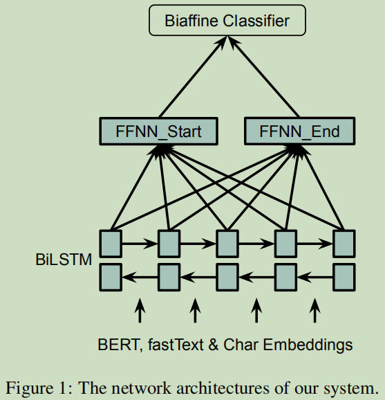

# 代码说明

## 环境配置
CUDA版本11.0，CUDNN版本8003，主要依赖：
``` txt
python==3.8.5
pytorch==1.7.0
```

## 数据
未使用公开数据

## 预训练模型
- 使用nezha-cn-base，路径存放于`data/pretrain_model/nezha-cn-base`，可由[lonePatient/NeZha_Chinese_PyTorch - Github](https://github.com/lonePatient/NeZha_Chinese_PyTorch)仓库中网盘链接获取；
- 使用比赛数据进行预训练，详情查看`train.sh`，输出预训练模型`data/pretrain_model/nezha-cn-base-wwm-seq128-lr2e-5-mlm0.15-100k-warmup3k-bs64x2`。

## 算法

### 整体思路介绍（必选）
**预训练**
- 语料：给定的训练集数据、A榜测试集、无标注数据；
- 文本长度：最短文本：10，最长文本128；
- 数据划分：预训练训练集与验证集比例为9:1；
- 预训练任务：Whole Word Mask，用jieba分词得到中文词边界；
- 预训练超参设置如下表

| 参数名 | 文本长度 | 掩词概率 | warmup(步数) | 训练总步数 | 批次大小 | 初始学习率 | 权重衰减 | 优化器 | 随机数种子 |
| --- | --- | --- | --- | --- | --- | --- | --- | --- | --- | --- |
| 参数值 | 128 | 0.15 | 3k | 100k | 64x2 | 2e-5 | 0.01 | AdamW | 42 |

**微调**
- 模型结构：采用span-based命名实体提取模型，枚举文本中所有片段后进行分类，详情可阅读论文；
    > [1] Zhong Z ,  Chen D . A Frustratingly Easy Approach for Joint Entity and Relation Extraction[J].  2020.
- 训练分为两阶段：
    - 第一阶段：采用全量训练集，并随机采样10000条无标注数据，推断得到伪标签；
    - 第二阶段：采用全量训练集，加上第一阶段未标注数据进行训练，该模型为输出模型；
- 后处理：该模型可提取嵌套实体，模型输出结果存在大量存在嵌套实体，采用NMS贪心策略进行去重。

### 方法的创新点（可选）
略

### 网络结构（必选）


### 损失函数（必选）
交叉熵损失，计算每个片段的分类损失

### 数据增广（可选）
无

### 模型集成（可选）
根据本赛题规则，只允许训练阶段进行模型集成，不允许预测阶段进行模型集成

### 算法的其他细节（可选）
历史实验结果见[UPDATED.md](UPDATE.md)

## 训练流程
[train.sh](train.sh)中已添加注释

## 测试流程
[test.sh](test.sh)中已添加注释，推断运行使用每行一个字的输入格式
``` sh
sh test.sh data/contest_data/preliminary_test_b/word_per_line_preliminary_B.txt
```

## 其他注意事项
无
